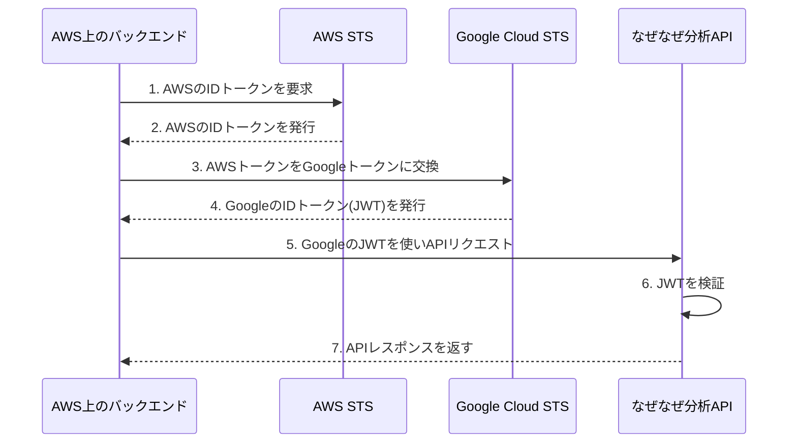

# なぜなぜ分析AIエージェント API利用ガイド

## 1. 概要

このドキュメントは、「なぜなぜ分析AI支援システム」が提供するREST APIの利用方法について説明します。
本APIを利用することで、外部システムからなぜなぜ分析機能の呼び出し、対話の実行、分析結果の取得が可能になります。

## 2. 認証

APIへのリクエストには、APIキーまたはJWTトークンによる認証が必要です。いずれか一方をHTTPヘッダーに含めてリクエストしてください。

### 2.1 APIキー認証

リクエストヘッダー `X-API-Key` に、払い出されたAPIキーを指定します。

```
X-API-Key: YOUR_API_KEY
```

### 2.2 JWTトークン認証

リクエストヘッダー `Authorization` に、`Bearer` スキームを用いてJWTトークンを指定します。

```
Authorization: Bearer YOUR_JWT_TOKEN
```

<details>
<summary><strong>JWT (JSON Web Token) とは？</strong></summary>

**JWT**（ジェイソン・ウェブ・トークン）は、二者間で情報を安全にやり取りするためのコンパクトで自己完結した方法を定めたオープン標準（RFC 7519）です。このプロジェクトでは、APIへのアクセスが許可された正当な利用者であることを証明するための「デジタル証明書」のように利用されます。

JWTは `.` で区切られた以下の3つのパートから構成されています。
1.  **ヘッダー (Header)**: トークンの種類（JWT）と署名アルゴリズム（例: `RS256`）を格納します。
2.  **ペイロード (Payload)**: ユーザーID、権限、有効期限などの情報（クレーム）を格納します。この情報を含んでいるため、サーバーは都度データベースを参照することなくユーザーを識別できます。
3.  **署名 (Signature)**: ヘッダーとペイロードが改ざんされていないこと、そして正当な発行者によって作成されたことを保証します。サーバーは秘密鍵に対応する公開鍵を使ってこの署名を検証します。

</details>

### 2.3 JWTトークンの取得方法について

本APIは、JWTトークンの**検証**のみを行い、**発行**は行いません。
API利用者は、別途用意された認証サーバーやIDプロバイダー (IdP) からJWTトークンを取得する必要があります。一般的な取得フローは以下の通りです。

1.  クライアントアプリケーションが、認証サーバーに自身のIDとシークレット等を送信して認証を要求します。
2.  認証サーバーは認証に成功すると、JWTトークンをクライアントに発行します。
3.  クライアントは、そのJWTトークンを `Authorization: Bearer <token>` ヘッダーに含めて本APIを呼び出します。

### 2.4 AWS上のシステムからの認証 (Workload Identity連携)

バックエンドシステムがAWS上で稼働している場合、Google Cloudの **Workload Identity連携 (Workload Identity Federation)** を利用した認証が最もセキュアで推奨される方法です。

この仕組みにより、Google Cloudのサービスアカウントキー（秘密鍵ファイル）のような長期的な認証情報をAWS環境に配置することなく、安全にAPIへアクセスできます。

#### 認証フロー



1.  **事前設定**: Google Cloud側で「Workload Identity プール」を作成し、特定のAWSロールをGoogle Cloudのサービスアカウントとして信頼する設定を行います。
2.  **トークン交換**: AWS上のバックエンドは、AWSの認証情報から取得したIDトークンを、Google CloudのSecurity Token Service (STS) に提示します。
3.  **GoogleのJWT取得**: Google STSはAWSのトークンを検証し、問題なければGoogle Cloudサービスアカウント権限を持つ、短期有効なJWTを発行します。
4.  **API呼び出し**: バックエンドは、取得したGoogleのJWTを使って本APIを呼び出します。

#### 参考文献

- **Google Cloud ドキュメント**: [Google での認証方法](https://cloud.google.com/docs/authentication?hl=ja) (Workload Identity Federationに関する項目をご参照ください)
- **AWS ブログ**: [Access AWS using a Google Cloud Platform native workload identity](https://aws.amazon.com/blogs/security/access-aws-using-a-google-cloud-platform-native-workload-identity/) (逆方向のアクセスパターンですが、ID連携のコンセプトを理解する上で参考になります)

認証に失敗した場合、HTTPステータスコード `401 Unauthorized` が返却されます。

## 3. ベースURL

すべてのAPIエンドポイントは、以下のベースURLを基準とします。

- **本番環境**: `https://<your-production-domain>/v1`
- **開発環境 (ローカル)**: `http://127.0.0.1:8000/v1`

## 4. エンドポイント仕様

### 4.1 新規分析スレッドの作成

新しいなぜなぜ分析のセッション（スレッド）を開始します。

- **メソッド**: `POST`
- **パス**: `/threads`

#### リクエストボディ (`application/json`)

分析対象の問題に関する情報を `problem` オブジェクトに含めて送信します。

```json
{
  "problem": {
    "title": "string (必須, 不具合概要/問題のタイトル)",
    "product_name": "string (任意, 製品名)",
    "occurrence_date": "string (任意, ISO8601形式の日時, 不具合発見日時)",
    "process": "string (任意, 対象工程/ライン番号)",
    "location": "string (任意, 発生場所（工場名・エリア）)",
    "severity": "string (任意, 問題の重大度, 'LOW'|'MEDIUM'|'HIGH')",
    "description": "string (任意, 問題の詳細説明)",
    "man_details": "string (任意, Man（人）の詳細)",
    "machine_details": "string (任意, Machine（機械）の詳細)",
    "material_details": "string (任意, Material（材料）の詳細)",
    "method_details": "string (任意, Method（方法）の詳細)",
    "measurement_details": "string (任意, Measurement（測定）の詳細)",
    "environment_details": "string (任意, Environment（環境）の詳細)",
    "timeline_analysis": "string (任意, 時系列分析)",
    "defect_types": [
      "string (任意, 不具合分類, 'APPEARANCE'|'DIMENSION'|'FUNCTION'|'MATERIAL'|'STRENGTH'|'DURABILITY'|'SAFETY'|'OTHER')"
    ],
    "other_defect_type": "string (任意, その他の不具合分類の詳細)",
    "frequency": "string (任意, 発生頻度, 'FREQUENT'|'OCCASIONAL'|'RARE'|'FIRST_TIME')",
    "frequency_percentage": "string (任意, 発生頻度の割合（%）)",
    "investigations": [
      {
        "date": "string (任意, ISO8601形式の日時, 実施日)",
        "content": "string (任意, 調査・試験内容)",
        "result": "string (任意, 結果)",
        "investigator": "string (任意, 実施者)"
      }
    ],
    "direct_cause": "string (任意, 直接原因)",
    "verification": {
      "method": "string (任意, 検証方法)",
      "result": "string (任意, 結果)",
      "date": "string (任意, ISO8601形式の日時, 実施日)",
      "verifier": "string (任意, 実施者)"
    },
    "language": "string (出力言語)"
  }
}
```

#### 成功レスポンス (`201 Created`)

作成されたスレッドのIDと作成時刻を返します。この `thread_id` は後続のAPI呼び出しで使用します。

```json
{
  "thread_id": "string (UUID, 作成されたスレッドの一意なID)",
  "created_at": "string (ISO8601形式の日時, 作成時刻)"
}
```

### 4.2 分析の実行と進捗のストリーミング受信

指定されたスレッドで分析を実行し、進捗をServer-Sent Events (SSE) 形式でストリーミング受信します。

- **メソッド**: `POST`
- **パス**: `/threads/{thread_id}/stream`

#### パスパラメータ

- `thread_id` (string, 必須): 対象のスレッドID

#### リクエストボディ (`application/json`)

ユーザーからの応答メッセージを指定します。スレッド作成後の初回実行時や、AIからの情報要求なしで分析を継続する場合は空のオブジェクト `{}` を送信します。

```json
{
  "user_message": "string (任意, ユーザー応答メッセージ)",
  "is_retry": "boolean (任意, デフォルトfalse, trueの場合はユーザーが入力内容を修正して再送信する意図を示す)"
}
```
*使用パターン:*
1.  **分析開始・継続**: `{}` で分析開始・継続
2.  **ユーザー応答**: `{"user_message": "具体的な回答内容"}` で分析継続
3.  **ユーザー入力修正**: `{"user_message": "修正した回答", "is_retry": true}` で再分析

#### レスポンス (SSE: `text/event-stream`)

分析の進捗に応じて、複数のイベントが順次送信されます。各イベントは `event: <イベント名>` と `data: <JSONデータ>` の形式で構成されます。

- **イベント: `final_result`**
  分析が完了し、最終結果を返します。
  ```json
  // data:
  {
    "event_type": "final_result",
    "thought": "string (エージェントの思考プロセス)",
    "state": { /* 最新の分析状態オブジェクト。詳細はGET /threads/{thread_id} を参照 */ }
  }
  ```

- **イベント: `info_request`**
  AIがユーザーに追加情報を要求しています。
  ```json
  // data:
  {
    "event_type": "info_request",
    "thought": "string (エージェントの思考プロセス)",
    "state": { /* 最新の分析状態オブジェクト。state.chat_history の最後にAIからの質問が含まれる */ }
  }
  ```

- **イベント: `others`**
  分析進行中の思考プロセスなど、上記以外のイベントです。
  ```json
  // data:
  {
    "event_type": "string (エージェントの実行しているアクション名)",
    "thought": "string (エージェントの思考プロセス)"
  }
  ```

### 4.3 最新の分析状態の取得

指定されたスレッドの最新の分析状態を取得します。

- **メソッド**: `GET`
- **パス**: `/threads/{thread_id}`

#### パスパラメータ

- `thread_id` (string, 必須): 対象のスレッドID

#### 成功レスポンス (`200 OK`)

スレッドの現在の状態、これまでの対話履歴、分析結果などを返します。

```json
{
  "thread_id": "string (スレッドID)",
  "created_at": "string (ISO8601形式の日時, スレッド作成時刻)",
  "updated_at": "string (ISO8601形式の日時, 最新チェックポイントの更新時刻)",
  "status": "string (分析状態, 'running'|'waiting_for_input'|'completed'|'error')",
  "state": {
    "problem": { /* 4.1で作成した ProblemInput オブジェクト */ },
    "chat_history": [
      { "type": "string (human|ai)", "content": "string" }
    ],
    "why_nodes": [
      {
        "id": "string",
        "name": "string",
        "level": "integer",
        "parent_id": "string (任意)",
        "children_ids": ["string"],
        "supporting_facts": "string",
        "is_root_cause": "boolean",
        "root_cause_confidence": "float (任意)",
        "root_cause_judgement": "string",
        "recurrence_prevention_measures": "string"
      }
    ],
    "root_causes": [
      {
        "cause": "string",
        "confidence": "float",
        "judgement_reason": "string",
        "countermeasures": "string"
      }
    ]
  }
}
```

## 5. コードサンプル

### cURL

#### スレッド作成
```bash
# YOUR_JWT_TOKEN は、認証サーバーから取得した実際のJWTに置き換えてください
curl -X POST "http://127.0.0.1:8000/v1/threads" \
-H "Content-Type: application/json" \
-H "Authorization: Bearer YOUR_JWT_TOKEN" \
-d '{
  "problem": {
    "title": "製品Aの塗装にムラが発生",
    "language": "ja"
  }
}'
```

#### 分析実行 (ストリーミング)
```bash
# YOUR_JWT_TOKEN は、認証サーバーから取得した実際のJWTに置き換えてください
curl -N -X POST "http://127.0.0.1:8000/v1/threads/{thread_id}/stream" \
-H "Content-Type: application/json" \
-H "Authorization: Bearer YOUR_JWT_TOKEN" \
-d '{}'
```

### Python (`requests` と `sseclient-py`)
<details>

```bash
# 必要なライブラリをインストール
pip install requests sseclient-py
```

```python
import requests
import sseclient
import json
import os

BASE_URL = "http://127.0.0.1:8000/v1"
# 認証サーバーから取得したJWTトークンを環境変数などから取得
JWT_TOKEN = os.environ.get("YOUR_API_JWT")

if not JWT_TOKEN:
    raise ValueError("JWTトークンが環境変数 YOUR_API_JWT に設定されていません。")

headers = {
    "Content-Type": "application/json",
    "Authorization": f"Bearer {JWT_TOKEN}"
}

# 1. 新規スレッドを作成
problem_data = {
    "problem": {
        "title": "製品Aの塗装にムラが発生",
        "language": "ja"
    }
}
response = requests.post(f"{BASE_URL}/threads", headers=headers, json=problem_data)
response.raise_for_status()
thread_info = response.json()
thread_id = thread_info["thread_id"]
print(f"スレッド作成完了: {thread_id}")

# 2. 分析を実行し、ストリーミングで受信
stream_url = f"{BASE_URL}/threads/{thread_id}/stream"
# 初回実行時は空のJSONを送信
with requests.post(stream_url, headers=headers, json={}, stream=True) as response:
    response.raise_for_status()
    # sseclient-py はストリーミングレスポンスの処理に便利
    client = sseclient.SSEClient(response)
    for event in client.events():
        print(f"Event: {event.event}")
        print(f"Data: {json.loads(event.data)}")
        print("-" * 20)

        # AIからの情報要求に応じて応答を返す場合
        # if event.event == "info_request":
        #    user_response = {"user_message": "次の応答メッセージ"}
        #    requests.post(stream_url, headers=headers, json=user_response) # この部分は別ストリームで処理が必要
```
</details>

### TypeScript (`axios` & `google-auth-library`)
*AWSなどのクラウド環境からWorkload Identity連携で認証する場合の実装例です。*

<details>

```bash
# 必要なライブラリをインストール
npm install axios google-auth-library
```
*`google-auth-library` を使うことで、安全にGoogle Cloudのアクセストークン（JWT）を取得できます。詳細は「2.4 AWS上のシステムからの認証」の章を参照してください。*

```typescript
import axios from 'axios';
import { GoogleAuth } from 'google-auth-library';

const API_BASE_URL = 'https://<your-api-domain>/v1';

// Workload Identity連携を利用してアクセストークンを取得する関数
async function getAccessToken(): Promise<string> {
  const auth = new GoogleAuth({
    // このAPIのURLを対象者(audience)として指定
    scopes: API_BASE_URL,
  });
  const client = await auth.getClient();
  const accessToken = await client.getAccessToken();
  if (!accessToken.token) {
    throw new Error('Failed to retrieve access token.');
  }
  return accessToken.token;
}

// 取得したトークンを使ってAPIを呼び出す
async function createThread(token: string) {
  const headers = {
    'Authorization': `Bearer ${token}`,
    'Content-Type': 'application/json',
  };

  const problemData = {
    problem: {
      title: '製品Aの塗装にムラが発生 (from TypeScript)',
      language: 'ja',
    },
  };

  try {
    const response = await axios.post(`${API_BASE_URL}/threads`, problemData, { headers });
    console.log('Thread created:', response.data);
    return response.data;
  } catch (error) {
    console.error('API request failed:', error);
    throw error;
  }
}

// 実行
async function main() {
  try {
    const jwtToken = await getAccessToken();
    await createThread(jwtToken);
  } catch (err) {
    // エラーハンドリング
  }
}

main();
```
</details>

## 6. エラー応答

APIは標準的なHTTPステータスコードを使用してエラーを示します。

| HTTP Status | エラーコード            | 説明                                   |
|-------------|-------------------------|----------------------------------------|
| `400`       | `INVALID_ARGUMENT`      | リクエストの形式が正しくない（必須フィールド欠如など） |
| `401`       | `UNAUTHENTICATED`       | 認証に失敗した（APIキーが無効など）     |
| `403`       | `PERMISSION_DENIED`     | アクセスが許可されていない（IP制限違反など） |
| `404`       | `NOT_FOUND`             | 指定されたリソースが見つからない（無効な`thread_id`など） |
| `429`       | `RATE_LIMIT`            | リクエストレートが上限を超えた         |
| `500`       | `INTERNAL`              | サーバー内部で予期せぬエラーが発生した |

## 7. セキュリティに関する補足

### IPホワイトリスト
セキュリティ設定により、特定のIPアドレスからのアクセスのみが許可されている場合があります。アクセスがブロックされる場合は、接続元IPアドレスがホワイトリストに登録されているか確認してください。

### レート制限
APIへの過剰なリクエストを防ぐため、リクエスト数に制限（デフォルト: 100リクエスト/時間）が設けられています。制限を超えた場合、HTTPステータスコード `429 Too Many Requests` が返されます。
