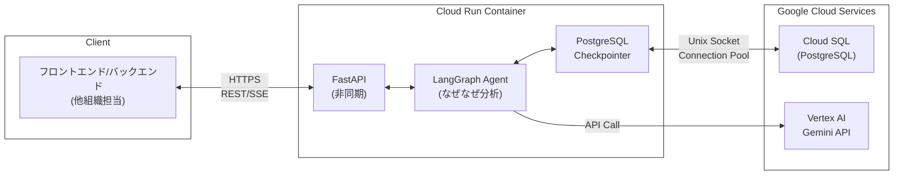

# 詳細設計書 〜 なぜなぜ分析AIエージェント API

## 1. 目的
本詳細設計書は、`docs/spec.md` で定義された要件に基づき、エージェント API の具体的な構成要素、インターフェース、データモデル、および運用設計を明確化することを目的とする。

## 2. システム全体構成

- Cloud Run でホストされる単一コンテナ内で FastAPI[^7] と LangGraph が統合動作。
- FastAPI は完全非同期実装により高いスケーラビリティを実現[^4]。
- LangGraph は langchain-google-cloud-sql-pg の PostgreSQL チェックポインターを使用して Cloud SQL に状態を永続化[^5]。
- Vertex AI Gemini API へのアクセスは LangChain 統合を使用。
- 開発言語は Python 3.12+[^8] を使用。
- OpenTelemetry[^9] (OTel) により Cloud Trace / Cloud Monitoring へメトリクス送信。

**統合アーキテクチャの利点:**
本システムは LangGraph を Cloud Run 上で直接実行することで、以下の利点を実現します：
- **シンプルな構成**: Vertex AI Reasoning Engine を使用しない分、システム構成が簡素化
- **低レイテンシ**: エージェント実行がローカルプロセス内で完結するため、ネットワーク遅延がない
- **柔軟な実装**: 完全な非同期実装により、高い並行処理性能を実現
- **コスト効率**: Cloud Run のスケールトゥゼロ機能により、使用時のみ課金

**接続管理とスケーラビリティ:**
- Cloud Run インスタンスあたり最大100のデータベース接続制限を考慮し、接続プーリングを実装
- langchain-google-cloud-sql-pg が内部で管理する接続プールによる効率的な接続管理
- 水平スケーリング時の総接続数管理が重要

## 3. API インターフェース
### 3.1 共通仕様
| 項目             | 内容                                                            |
|------------------|----------------------------------------------------------------|
| ベース URL       | `/v1`                                                           |
| 認証             | HTTP Header `X-API-Key: <token>` または `Authorization: Bearer <jwt>` |
| コンテンツタイプ | `application/json; charset=utf-8`                               |
| ストリーミング   | Server-Sent Events (SSE, `text/event-stream`), FastAPI非同期ジェネレータを使用 |

### 3.2 エンドポイント一覧
| 区分                | メソッド & パス                            | 説明                                   | 優先度 |
|--------------------|------------------------------------------|----------------------------------------|------|
| スレッド初期化      | `POST /v1/threads`                       | 新規分析スレッドを作成                   | 必須   |
| ストリーミング実行    | `POST /v1/threads/{thread_id}/stream`    | ユーザー応答を送信し SSE で分析進捗を受信    | 必須   |
| 状態取得            | `GET /v1/threads/{thread_id}`            | 最新の分析状態を取得                       | 必須   |

### 3.3 リクエスト / レスポンス定義
各エンドポイントの目的とユースケース、および詳細なデータモデルを以下に説明します。

#### 3.3.1 `POST /v1/threads`
**ユースケース**: 新規なぜなぜ分析スレッドの開始時。ユーザーが問題情報を入力し分析を開始する時点で呼び出されます。

**リクエストボディ (`application/json`)**

```json
{
  "problem": {
    // why_why_chat_ai.models.ProblemInput に準拠
    "title": "string (必須, 不具合概要/問題のタイトル)",
    "product_name": "string (任意, 製品名)",
    "occurrence_date": "string (任意, ISO8601形式の日時, 不具合発見日時)",
    "process": "string (任意, 対象工程/ライン番号)",
    "location": "string (任意, 発生場所（工場名・エリア）)",
    "severity": "string (任意, 問題の重大度, 'LOW'|'MEDIUM'|'HIGH')",
    "description": "string (任意, 問題の詳細説明)",
    "man_details": "string (任意, Man（人）の詳細)",
    "machine_details": "string (任意, Machine（機械）の詳細)",
    "material_details": "string (任意, Material（材料）の詳細)",
    "method_details": "string (任意, Method（方法）の詳細)",
    "measurement_details": "string (任意, Measurement（測定）の詳細)",
    "environment_details": "string (任意, Environment（環境）の詳細)",
    "timeline_analysis": "string (任意, 時系列分析)",
    "defect_types": [
      "string (任意, 不具合分類, 'APPEARANCE'|'DIMENSION'|'FUNCTION'|'MATERIAL'|'STRENGTH'|'DURABILITY'|'SAFETY'|'OTHER')"
    ],
    "other_defect_type": "string (任意, その他の不具合分類の詳細)",
    "frequency": "string (任意, 発生頻度, 'FREQUENT'|'OCCASIONAL'|'RARE'|'FIRST_TIME')",
    "frequency_percentage": "string (任意, 発生頻度の割合（%）)",
    "investigations": [
      {
        "date": "string (任意, ISO8601形式の日時, 実施日)",
        "content": "string (任意, 調査・試験内容)",
        "result": "string (任意, 結果)",
        "investigator": "string (任意, 実施者)"
      }
    ],
    "direct_cause": "string (任意, 直接原因)",
    "verification": {
      "method": "string (任意, 検証方法)",
      "result": "string (任意, 結果)",
      "date": "string (任意, ISO8601形式の日時, 実施日)",
      "verifier": "string (任意, 実施者)"
    },
    "language": "string (出力言語)"
  }
}
```

**レスポンス (`201 Created`)**

```json
{
  "thread_id": "string (UUID, 作成されたスレッドの一意なID)",
  "created_at": "string (ISO8601形式の日時, 作成時刻)"
}
```

#### 3.3.2 `POST /v1/threads/{thread_id}/stream`
**ユースケース**: 対話型分析の進行中に使用。ユーザーの回答を送信し、LangGraphエージェントからのリアルタイム分析結果（初期分析、情報要求、最終結果など）をストリーミングで受信します。「なぜ」の連鎖分析が進行する過程で継続的に使用されます。

**パスパラメータ**
- `thread_id`: string (必須, 対象のスレッドID)

**リクエストボディ (`application/json`)**

初回分析開始時とユーザー応答時の両方で使用します：

```json
{
  "user_message": "string (任意, ユーザー応答メッセージ。初回分析開始時は省略可能)",
  "is_retry": "boolean (任意, デフォルトfalse, trueの場合はユーザーが入力内容を修正して再送信する意図を示す)"
}
```

**使用パターン:**
1. **分析開始・継続**: `{}` で分析開始・継続
2. **ユーザー応答**: `{"user_message": "具体的な回答内容"}` で分析継続
3. **ユーザー入力修正**: `{"user_message": "修正した回答", "is_retry": true}` で再分析


**レスポンス (SSE: `text/event-stream`)**

各イベントは以下の形式で送信されます。
`event: <event_type>`
`data: <json_payload>`

**イベントタイプとペイロード詳細:**

1.  **`final_result`**: 分析が完了し最終結果を返す場合
    ```json
    // data:
    {
      "event_type": "final_result",
      "thought": "string (エージェントの思考プロセス)",
      "state": { // why_why_chat_ai.why_why_agent.WhyWhyAgentBuilder.State に準拠
        "problem": { /* ProblemInput オブジェクト */ },
        "chat_history": [
          { "type": "string (human|ai)", "content": "string" } // Langchain BaseMessage 形式
        ],
        "why_nodes": [
          { // why_why_chat_ai.models.WhyNode に準拠
            "id": "string",
            "name": "string",
            "level": "integer",
            "parent_id": "string (任意)",
            "children_ids": ["string"],
            "supporting_facts": "string",
            "is_root_cause": "boolean",
            "root_cause_confidence": "float (任意)",
            "root_cause_judgement": "string",
            "recurrence_prevention_measures": "string"
          }
        ],
        "root_causes": [
          { // why_why_chat_ai.models.RootCauseSchema オブジェクト
            "cause": "string",
            "confidence": "float",
            "judgement_reason": "string",
            "countermeasures": "string"
          }
        ]
      }
    }
    ```

2.  **`info_request`**: エージェントがユーザーに追加情報を要求する場合
    ```json
    // data:
    {
      "event_type": "info_request",
      "thought": "string (エージェントの思考プロセス)",
      "state": { // why_why_chat_ai.why_why_agent.WhyWhyAgentBuilder.State に準拠
          // chat_history の最後のエントリにエージェントからの質問が含まれる
      }
    }
    ```
    注: エージェントからの質問は `state.chat_history` の最後のメッセージに含まれている。

3.  **`others`**: 分析進行中の思考プロセス
    ```json
    // data:
    {
      "event_type": "string (エージェントの実行しているアクション名)",
      "thought": "string (エージェントの思考プロセス)"
    }
    ```


#### 3.3.3 `GET /v1/threads/{thread_id}`
**ユースケース**: 現在の分析状態を確認する時に使用。UIの更新やスレッドの状態確認が必要な時、特に再接続時やページリロード後に使用されます。分析の進行状況や結果を非同期で取得する場合にも便利です。

**パスパラメータ**
- `thread_id`: string (必須, 対象のスレッドID。`langgraph_checkpoints.thread_id` に対応)

**レスポンス (`200 OK`)**

```json
{
  "thread_id": "string (スレッドID)",
  "created_at": "string (ISO8601形式の日時, スレッド作成時刻)",
  "updated_at": "string (ISO8601形式の日時, 最新チェックポイントの更新時刻)",
  "status": "string (分析状態, 'running'|'waiting_for_input'|'completed'|'error')",
  "state": { // why_why_chat_ai.why_why_agent.WhyWhyAgentBuilder.State に準拠 (最新チェックポイントから取得)
    "problem": { /* why_why_chat_ai.models.ProblemInput オブジェクト（言語設定を含む） */ },
    "chat_history": [
      { "type": "string (human|ai)", "content": "string" } // Langchain BaseMessage 形式
    ],
    "why_nodes": [
      { // why_why_chat_ai.models.WhyNode に準拠
        "id": "string",
        "name": "string",
        "level": "integer",
        "parent_id": "string (任意)",
        "children_ids": ["string"],
        "supporting_facts": "string",
        "is_root_cause": "boolean",
        "root_cause_confidence": "float (任意)",
        "root_cause_judgement": "string",
        "recurrence_prevention_measures": "string"
      }
    ],
    "root_causes": [
      { // why_why_chat_ai.models.RootCauseSchema オブジェクト
        "cause": "string",
        "confidence": "float",
        "judgement_reason": "string",
        "countermeasures": "string"
      }
    ]
  }
}
```

### 3.4 エラー応答
| HTTP Status | 意味                 | エラーコード            | 例                   |
|------------|----------------------|---------------------|----------------------|
| 400        | バリデーションエラー   | `INVALID_ARGUMENT`     | 必須フィールド欠如     |
| 401        | 認証失敗             | `UNAUTHENTICATED`      | API Key 無効         |
| 403        | 権限不足             | `PERMISSION_DENIED`    | IP 制限違反         |
| 404        | セッション未存在       | `NOT_FOUND`            | 無効 thread_id     |
| 429        | レート制限             | `RATE_LIMIT`           | 上限超過             |
| 500        | 内部エラー             | `INTERNAL`             | 予期せぬ例外         |

---
## 4. 内部モジュール設計
### 4.1 ディレクトリ構成
```
why_why_chat_ai/
 ├── api/
 │    ├── app.py           # FastAPI エントリポイント
 │    ├── routers/
 │    │    └── threads.py  # 各エンドポイント実装
 │    ├── models.py        # Pydantic リクエスト/レスポンスモデル
 │    └── telemetry.py     # OTel 設定
 ├── agent/
 │    ├── why_why_agent.py # LangGraphエージェント実装
 │    └── checkpointer.py  # PostgreSQL チェックポインター設定
```

### 4.2 主要クラス & 関数
| モジュール       | 名前                         | 役割                          |
|------------------|------------------------------|-------------------------------|
| `agent/why_why_agent.py` | `WhyWhyAgent.astream()`     | LangGraphエージェントの非同期ストリーミング実行   |
|                   | `WhyWhyAgent.aget_state()`   | 現在の分析状態を非同期で取得                  |
| `agent/checkpointer.py` | `get_checkpointer()`         | Cloud SQL統合PostgreSQLチェックポインターの取得  |

### 4.3 データベーススキーマ

langchain-google-cloud-sql-pg の PostgreSQL チェックポインターは、以下のテーブルを自動的に作成・管理します[^6]。これらのテーブルは初回起動時に `setup()` メソッドによって作成されます。

**1. `checkpoints` テーブル**
   - チェックポイントの主要な情報を格納します。
   - カラム:
     - `thread_id TEXT NOT NULL`: スレッド識別子 (APIの `thread_id` に相当)
     - `checkpoint_ns TEXT NOT NULL DEFAULT ''`: チェックポイントの名前空間 (通常は `thread_id` と同じか、特定の用途で区別)
     - `checkpoint_id TEXT NOT NULL`: チェックポイントのユニークID (LangGraphが生成するUUIDなど)
     - `parent_checkpoint_id TEXT`: 親チェックポイントのID (存在する場合)
     - `type TEXT`: チェックポイントのタイプ (例: `"checkpoint"`)
     - `checkpoint JSONB NOT NULL`: チェックポイントの本体データ (LangGraphのエージェント状態 `WhyWhyAgentBuilder.State` を含む)
     - `metadata JSONB NOT NULL DEFAULT '{}'`: 任意の追加メタデータ (例: `source`, `step`, `writes` など、APIからの入力configもここに保存可能)
   - プライマリキー: `(thread_id, checkpoint_ns, checkpoint_id)`
   - インデックス例: `CREATE INDEX CONCURRENTLY IF NOT EXISTS checkpoints_thread_id_idx ON checkpoints(thread_id);` (スレッドIDでの検索を効率化)

**2. `checkpoint_blobs` テーブル**
   - 大きなチャネル値 (blobデータ) を別途格納し、`checkpoints` テーブルの `checkpoint` JSONB内の `channel_versions` から参照されます。
   - カラム:
     - `thread_id TEXT NOT NULL`
     - `checkpoint_ns TEXT NOT NULL DEFAULT ''`
     - `channel TEXT NOT NULL`: チャネル名 (例: `"__start__"`, `"problem_input"` など)
     - `version TEXT NOT NULL`: チャネルのバージョン (LangGraphが管理するタイムスタンプベースのバージョン)
     - `type TEXT NOT NULL`: blobのシリアライズタイプ (例: `"json"`, `"pickle"`)
     - `blob BYTEA`: blobデータ本体 (NULL許容)
   - プライマリキー: `(thread_id, checkpoint_ns, channel, version)`
   - インデックス例: `CREATE INDEX CONCURRENTLY IF NOT EXISTS checkpoint_blobs_thread_id_idx ON checkpoint_blobs(thread_id);`

**3. `checkpoint_writes` テーブル**
   - チェックポイントに関連する中間的な書き込み操作 (タスクの出力など) を記録します。
   - カラム:
     - `thread_id TEXT NOT NULL`
     - `checkpoint_ns TEXT NOT NULL DEFAULT ''`
     - `checkpoint_id TEXT NOT NULL`: 関連するチェックポイントID
     - `task_id TEXT NOT NULL`: 書き込みを行ったタスクのID
     - `task_path TEXT NOT NULL DEFAULT ''`: (サブグラフの場合など)タスクのパス
     - `idx INTEGER NOT NULL`: 同一タスク内での書き込み順序
     - `channel TEXT NOT NULL`: 書き込み対象のチャネル
     - `type TEXT`: blobのシリアライズタイプ
     - `blob BYTEA NOT NULL`: 書き込みデータ本体
   - プライマリキー: `(thread_id, checkpoint_ns, checkpoint_id, task_id, idx)`
   - インデックス例: `CREATE INDEX CONCURRENTLY IF NOT EXISTS checkpoint_writes_thread_id_idx ON checkpoint_writes(thread_id);`

**4. `checkpoint_migrations` テーブル**
   - スキーマのマイグレーションバージョンを管理します。
   - カラム:
     - `v INTEGER PRIMARY KEY`: マイグレーションバージョン番号

**備考:**
- 対話履歴 (`chat_history`) やエージェントの内部状態 (`WhyWhyAgentBuilder.State` の各フィールド) は、主に `checkpoints` テーブルの `checkpoint` JSONB カラム内にシリアライズされて保存されます。
- PostgreSQL チェックポインターは FastAPI のライフサイクル管理で `setup()` メソッド呼び出し時に自動で作成・マイグレーションします[^6]。
- langchain-google-cloud-sql-pg が内部で接続プールを管理し、効率的なデータベースアクセスを実現します。

### 4.4 非同期処理フロー
1. `/v1/threads/{thread_id}/stream` 受信 → `WhyWhyAgent.astream()` を非同期で実行。
2. `WhyWhyAgent.astream()` は非同期ジェネレータとして動作し、LangGraphからのイベントを逐次処理。
3. 各イベント受信ごとに:
   - LangGraph が自動的にチェックポイント保存を実行（PostgreSQLチェックポインター経由）。
   - SSEイベントとしてクライアントへプッシュ[^4]。
4. LangGraph が `info_request` (ユーザーへの情報要求) を示すイベントを返した場合、API はそのイベントをSSE経由でクライアントに転送し、クライアントからの次のリクエストを待機。

### 💡 実装パターン

**FastAPI ライフサイクル管理**[^2]:
```python
from contextlib import asynccontextmanager
from fastapi import FastAPI
from langchain_google_cloud_sql_pg import PostgresEngine, PostgresSaver
import os

@asynccontextmanager
async def lifespan(app: FastAPI):
    # Cloud SQL 接続エンジンの作成
    engine = await PostgresEngine.afrom_instance(
        project_id=os.getenv("GOOGLE_CLOUD_PROJECT"),
        region=os.getenv("CLOUD_SQL_REGION"),
        instance=os.getenv("CLOUD_SQL_INSTANCE"),
        database=os.getenv("CLOUD_SQL_DATABASE"),
        user=os.getenv("CLOUD_SQL_USER"),
        password=os.getenv("CLOUD_SQL_PASSWORD"),
    )

    # チェックポインターの作成と初期化
    checkpointer = PostgresSaver.create(engine)
    await checkpointer.setup()

    app.state.checkpointer = checkpointer
    app.state.engine = engine
    yield

    # クリーンアップ
    await engine.close()

app = FastAPI(lifespan=lifespan)
```

**Cloud SQL 接続設定**[^3]:
- langchain-google-cloud-sql-pg が自動的に Cloud SQL への接続を管理
- 内部で Unix ソケット接続と接続プールを最適化
- Cloud Run 環境での自動認証とIAM統合をサポート

---
## 5. セキュリティ設計
- **認証**: API Key / JWT を FastAPI ミドルウェアで検証。
- **認可**: API呼び出し元システム（例: 他組織が担当するバックエンドシステム）が、エンドユーザーの認証および `thread_id` へのアクセス認可を行うことを前提とします。本APIは、APIキーまたはJWTによる呼び出し元システムの認証のみを行います。個別の `thread_id` に対するアクセス制御は、呼び出し元システムの責任範囲となります。
- **暗号化**: Google-managed Encryption；外部接続用 TLS1.3。
- **入力検証**: Pydantic[^10] による JSON schema バリデーション。
- **OWASP対策**: SQLインジェクション (ORM+パラメタバインド), XSS (JSONのみ), DOS (レートリミット)。

---
## 6. ロギング & モニタリング
| 項目                    | 実装                                        |
|------------------------|---------------------------------------------|
| 分析トレース             | `opentelemetry-sdk` + Cloud Trace exporter  |
| パフォーマンスメトリクス   | FastAPI Middleware + Cloud Monitoring       |
| LLM 使用量              | `langchain.callbacks` で token_count を収集  |
| アラート                | スロークエリ、エラー率 > 1% で PagerDuty 通知    |

---
## 7. テスト戦略
### 7.1 単体テスト
- Pydantic バリデーション、ビジネスロジックを `pytest`[^11] で網羅。
- 非同期関数のテストには `pytest-asyncio` を使用。
- Vertex AI同期呼び出し部分は同期テスト、その他は非同期テスト。

### 7.2 統合テスト
- `FastAPI TestClient` で API 呼出し（非同期テストクライアント `AsyncClient` を使用）。
- Vertex LangGraph は `mock` でスタブ化。
- 非同期ストリーミングエンドポイントのテスト対応。

### 7.3 負荷テスト
- `locust` による SSE 同時接続シナリオ。

---
## 8. 移行 & デプロイ
| ステップ     | 内容                                                      |
|------------|-----------------------------------------------------------|
| CI         | GitHub Actions で `pytest` & `ruff` lint 実行              |
| CD         | Cloud Build → Cloud Run deploy；DB Migration は `alembic`  |
| IaC        | Terraform (google provider) でサービス・DB 作成              |

---
## 9. 既知の制約と今後の課題
- **接続管理**: Cloud Run インスタンスあたり100接続の制限があるため、スケーリング時の総接続数管理が重要。
- **コールドスタート**: LangGraph の初期化とデータベース接続確立によるレイテンシ → 最小インスタンス数の設定で緩和。
- **Gemini API のレイテンシ**: 30s を越える場合がある → ストリーミングレスポンスで体感速度を改善。
- **セッション並列実行数**: 高負荷時の LangGraph 並行処理の最適化が必要。
- **将来的な拡張**: マルチモーダル入力 (画像/音声) 対応、PgBouncer 導入による接続効率化。


[^1]: [LangGraph v0.2: Increased customization with new checkpointer libraries](https://blog.langchain.com/langgraph-v0-2/) - LangGraph v0.2 では PostgreSQL チェックポインターが大幅に改善され、本番環境での使用に最適化されています。

[^2]: [Deploying LangGraph with FastAPI](https://medium.com/@sajith_k/deploying-langgraph-with-fastapi-a-step-by-step-tutorial-b5b7cdc91385) - FastAPI と LangGraph の統合パターンとベストプラクティス

[^3]: [Connect from Cloud Run | Cloud SQL for PostgreSQL](https://cloud.google.com/sql/docs/postgres/connect-run) - Cloud Run から Cloud SQL への接続に関する公式ガイド

[^4]: [Server-Sent Events (SSE) in FastAPI](https://medium.com/@Rachita_B/implementing-sse-server-side-events-using-fastapi-3b2d6768249e) - SSEは単方向のサーバーからクライアントへのリアルタイムデータプッシュに適しており、WebSocketsより軽量で実装が容易。また、[FastAPI with SSE streaming](https://medium.com/@mikez.garcia/how-to-push-data-to-the-browser-with-fastapi-and-python-using-server-sent-events-f4bc862df42a)によると、標準的なHTTP接続を使用するため、既存のインフラとの互換性が高い。

[^5]: [General best practices | Cloud SQL for PostgreSQL](https://cloud.google.com/sql/docs/postgres/best-practices) - LangGraphのチェックポイント管理には高可用性と信頼性が求められ、Cloud SQLは自動バックアップ、ポイントインタイムリカバリ、レプリケーションを提供。また、[LangGraph Checkpoint on Postgres](https://github.com/googleapis/langchain-google-cloud-sql-pg-python/blob/main/docs/langgraph_checkpoint.ipynb)では、CloudSQL PostgreSQLとの統合例が示されています。

[^6]: [LangGraph Checkpointer on PostgreSQL](https://pypi.org/project/langgraph-checkpoint-postgres/) - LangGraphのPostgreSQLチェックポインターは、エージェントの状態とチャネルデータを効率的に管理するための専用スキーマを提供します。

[^7]: [FastAPI vs Flask Performance Comparison](https://hackernoon.com/fastapi-vs-flask-a-detailed-comparison-for-python-developers) - FastAPIは15,000-20,000 RPS（Flask: 2,000-3,000 RPS）の高性能を実現。ASGIベースで非同期処理に最適化されており、高トラフィックAPIに適している。また、[FastAPI Performance Benchmarks](https://www.techempower.com/benchmarks/#section=data-r21) によると、FastAPIは他のPythonフレームワークと比較して優れたパフォーマンスを示している。

[^8]: [Python 3.12 Performance Improvements](https://docs.python.org/3/whatsnew/3.12.html#summary-release-highlights) - Python 3.12では新しいtype parameter syntax（PEP 695）、改良されたf-string（PEP 701）、64%高速化されたtokenization、全体的なパフォーマンス向上を実現。また、[Python 3.12 Benchmarks](https://realpython.com/python312-new-features/#performance-improvements) によると、従来バージョンと比較して大幅な性能向上が確認されている。

[^9]: [OpenTelemetry Benefits](https://opentelemetry.io/docs/what-is-opentelemetry/) - OpenTelemetryはベンダーニュートラルな観測可能性フレームワークであり、Pythonライブラリの自動インストルメンテーション、分散トレーシング、メトリクス収集機能を提供。[CNCF最速成長プロジェクト](https://www.cncf.io/blog/2023/10/11/cncf-annual-report-2023/) として強いコミュニティサポートを得ている。

[^10]: [Pydantic vs Traditional Validation](https://pydantic-docs.helpmanual.io/usage/validators/) - PydanticはPythonのtype hintsを使用した型安全な検証、Rustベースコアによる高性能、FastAPIとの優れた統合性を実現。データベースレベルでの検証よりも早期のバリデーションとより良いエラーメッセージを提供。

[^11]: [pytest vs unittest Comparison](https://docs.pytest.org/en/stable/how.html#pytest-and-unittest-py-test-vs-unittest) - pytestはunittestより簡潔な構文、強力なfixture system、豊富なプラグインエコシステム、自動テスト発見、パラメータ化テスト対応を提供。モダンPythonプロジェクトで推奨されるテストフレームワーク。
